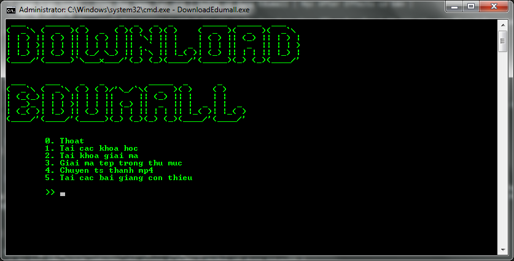
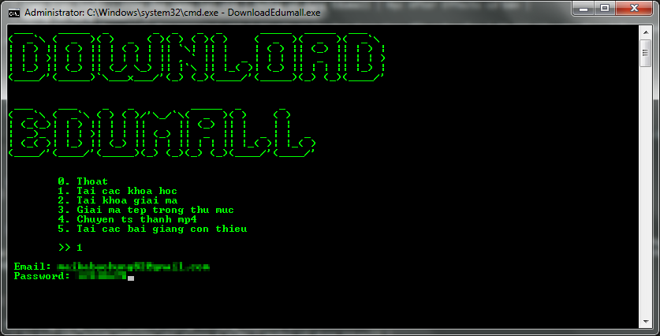
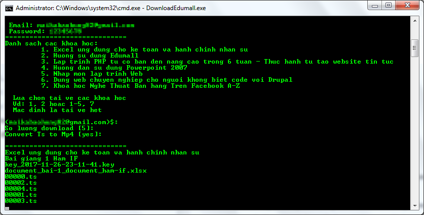
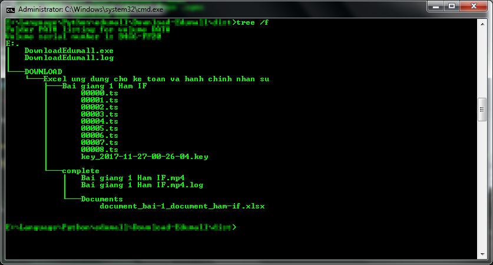
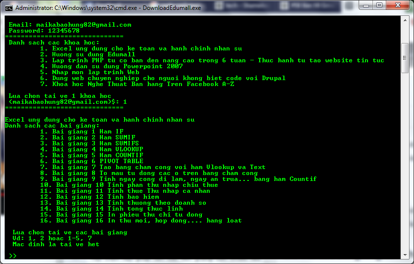

# DOWNLOAD EDUMALL

Download Edumall là ứng dụng đơn giản giúp tải các video trên [edumall.vn](https://edumall.vn/)

# Hướng dẫn sử dụng:
## 1. Link tải: [Tải](https://github.com/NguyenKhong/Download_Edumall/raw/master/exe/DownloadEdumall.exe)
## 2. Các tính năng:
* Tải video các khóa học hiện đang có trong tài khoản.
* Tải các khóa giải mã các tệp tin video khi có vấn đề.
* Giải mã các video đã bị mã hóa.
* Chuyển các tệp tin ts thành mp4.
* Tải các bài giảng còn thiếu trong một khóa học nhất định.
### 2.1 Tải các khóa học:
* Chọn 1, enter
* Nhập email và password.

* Chọn một hoặc nhiều khóa học bất kì. Mặc định bỏ trống và Enter là tải về tất cả các khóa học. Ví dụ 1 hoặc 1,3,5 hoặc 1-10 hoặc bỏ trống.
* Tiếp theo nhập số luồng tải về cùng lúc. Mặc định bỏ trống và enter là 5 luồng.( *Lời khuyên tùy vào tốc độ mạng mà chọn số luồng phù hợp, và số luồng nên <= 10*)
* Chuyển các tệp ts về dạng mp4. Mặc định bỏ trống và enter là đồng ý. Ví dụ: Y, N, yes, no.

* Quá trình tải mất từ vài phút đến hàng giờ tùy vào từng khóa học, có bao gồm việc tải các tệp tin đính kèm ở mỗi bài học. Sau khi tải các file ts sẽ được ghép lại thành mp4 và lưu trong thư mục với cấu trúc sau:

### 2.2 Tải các khóa giải mã các tệp tin video khi có vấn đề.
 Trong quá trình tải các khóa giải mã tệp tin ts thì có một số nguyên nhân phía bên server hoặc mạng gặp vấn đề, lúc này việc giải mã không hoàn tất, khi đó nên dùng tùy chọn này.
 * Chọn 2, Enter
 * Tương tự các bước trên.
### 2.3 Giải mã các video đã bị mã hóa.
 Sau khi tải các khóa giải mã ở bước trên, dùng tùy chọn này để giải mã các tệp tin ts. Các tệp tin ts cũ sẽ được sao lưu tại thư mục **Tên bài giảng/Bak/\*.ts**
* Chọn 3, Enter.
* Nhập đường dẫn chứa tệp tin ts cần giải mã. Mặc định là thư mục **DOWNLOAD** hiện hành.
### 2.4 Chuyển các tệp tin ts thành mp4.
 Sau khi giải mã xong tệp tin ts, dùng tùy chọn này để ghép các tệp tin ts này lại thành mp4. Hoặc có thể dùng các phần mềm khác ghép lại cũng được.
* Chọn 4, Enter
* Nhập đường dẫn chứa tệp tin ts cần giải mã. Mặc định là thư mục **DOWNLOAD** hiện hành.
### 2.5 Tải các bài giảng còn thiếu trong một khóa học nhất định.
 Tùy chọn này giúp tải các bài giảng còn thiếu nếu trong tùy chọn 1 không tải về được vì một nguyên nhân nào đó.
* Chọn 5, Enter.
* Lựa chọn duy nhất 1 khóa học.
* Lựa chọn tải về 1 hoặc nhiều bài giảng. Mặc định bỏ trống và enter thì sẽ tải về hết. Ví dụ: 1 hoặc 3, 5 hoặc 1-10. 

## 3. Lưu ý:
* Sau khi tải về các bài giảng, vào các thư mục **DOWNLOAD/Tên khóa học/Complete/** để lấy các video bài giảng và các tệp đính kèm.
* Cùng thư mục với phần mềm, khi phần mềm chạy sẽ phát sinh tệp **DownloadEdumall.log**, sau khi tải xong thì mở tệp này và xem có thông báo nào không, nếu có **WARNING, ERROR, CRITICAL** copy chúng và đưa cho nhà phát triển để cải thiện sản phẩm.
